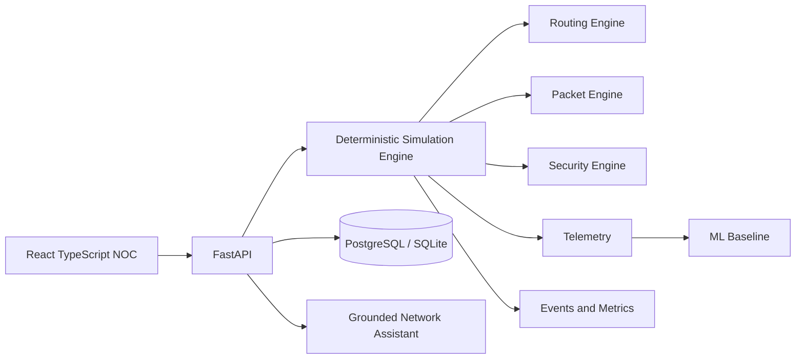

```mermaid
flowchart LR
UI[React TypeScript NOC] --> API[FastAPI]
API --> SIM[Deterministic Simulation Engine]
API --> DB[(PostgreSQL / SQLite)]
SIM --> ROUTE[Routing Engine]
SIM --> PACKET[Packet Engine]
SIM --> SEC[Security Engine]
SIM --> TEL[Telemetry]
TEL --> ML[ML Baseline]
API --> AI[Grounded Network Assistant]
SIM --> OBS[Events and Metrics]
```
